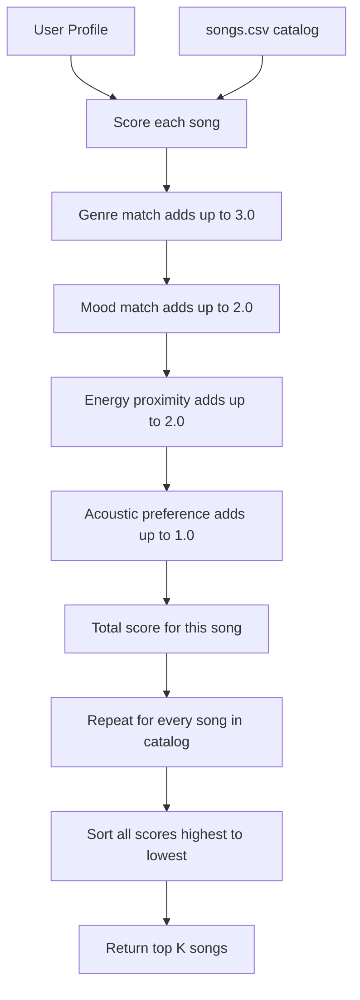

# 🎵 Music Recommender Simulation

## Project Summary

In this project you will build and explain a small music recommender system.

Your goal is to:

- Represent songs and a user "taste profile" as data
- Design a scoring rule that turns that data into recommendations
- Evaluate what your system gets right and wrong
- Reflect on how this mirrors real world AI recommenders

Replace this paragraph with your own summary of what your version does.

---

## How The System Works

Real-world music platforms like Spotify and TikTok mostly rely on two approaches to figure out what you might want to hear next.

The first is collaborative filtering, which basically says "people who liked what you liked also liked this." It looks at the behavior of millions of users (plays, skips, likes, playlist adds) and finds patterns without actually knowing anything about the songs themselves. Spotify's Discover Weekly works this way.

The second is content-based filtering, which says "this song has similar attributes to songs you already enjoy." It looks directly at the song's features like genre, energy, and tempo and compares them to what a user prefers. TikTok mixes this with engagement signals like how long you watch a video before scrolling.

This simulator uses content-based filtering. It takes a user's taste preferences, scores every song based on how well it matches, and returns the top results.

**What each Song tracks:**

- genre - the musical category (pop, lofi, rock, ambient, etc.)
- mood - the emotional tone (happy, chill, intense, relaxed, focused, moody)
- energy - how loud and intense the song feels, on a scale from 0.0 to 1.0
- tempo_bpm - beats per minute
- valence - how positive or joyful the song sounds, from 0.0 (dark) to 1.0 (bright)
- danceability - how easy it is to dance to, from 0.0 to 1.0
- acousticness - how acoustic vs electronic the song is, from 0.0 to 1.0

**What each UserProfile stores:**

- favorite_genre - the genre they prefer most
- favorite_mood - the mood they usually listen for
- target_energy - the energy level they want (0.0 to 1.0)
- likes_acoustic - whether they prefer acoustic sounds over electronic ones

**How a song gets scored:**

Each song gets a score based on how well it matches the user. Genre match is worth the most (weight 3.0) because it's the clearest signal of what someone is in the mood for. Mood match comes second (weight 2.0) since the emotional vibe matters a lot. Energy is scored by proximity (weight 2.0) meaning a song that's close to your target energy scores better than one that's very far off, using the formula 1 minus the absolute difference. Acoustic preference gets a smaller weight (1.0) as a bonus when the song's acoustic feel lines up with what the user wants.

**How the final list is built:**

Every song in the catalog gets scored individually. Then the list is sorted from highest to lowest score, and the top k songs are returned as recommendations.

**Example user profile this system was designed around:**

- favorite_genre: pop
- favorite_mood: happy
- target_energy: 0.8
- likes_acoustic: False

**Algorithm Recipe (exact weights):**

- Genre match - +3.0 points (all or nothing, either it matches or it doesn't)
- Mood match - +2.0 points (same, binary)
- Energy proximity - up to +2.0 points, calculated as 2.0 times (1 minus the difference between target energy and song energy)
- Acoustic preference - up to +1.0 points, based on how close the song's acousticness is to what the user wants

The maximum a song can score is 8.0. A perfect match on genre, mood, energy, and acoustic feel all at once.

**Data flow:**



**Known biases to watch for:**

Genre has the highest weight, which means a mediocre pop song will almost always beat a great jazz song for a user who listed pop as their favorite. The system never suggests anything outside the stated genre unless the catalog is small enough that genre matches run out. This is called a filter bubble, and it is a real problem in production recommenders too. Mood is the second biggest factor, so a song with a mismatched mood (like an intense track for a user who wants chill) gets heavily penalized even if everything else lines up.

---

## Getting Started

### Setup

1. Create a virtual environment (optional but recommended):

   ```bash
   python -m venv .venv
   source .venv/bin/activate      # Mac or Linux
   .venv\Scripts\activate         # Windows

2. Install dependencies

```bash
pip install -r requirements.txt
```

3. Run the app:

```bash
python -m src.main
```

### Running Tests

Run the starter tests with:

```bash
pytest
```

You can add more tests in `tests/test_recommender.py`.

---

## Experiments You Tried

Use this section to document the experiments you ran. For example:

- What happened when you changed the weight on genre from 2.0 to 0.5
- What happened when you added tempo or valence to the score
- How did your system behave for different types of users

---

## Limitations and Risks

Summarize some limitations of your recommender.

Examples:

- It only works on a tiny catalog
- It does not understand lyrics or language
- It might over favor one genre or mood

You will go deeper on this in your model card.

---

## Reflection

Read and complete `model_card.md`:

[**Model Card**](model_card.md)

Write 1 to 2 paragraphs here about what you learned:

- about how recommenders turn data into predictions
- about where bias or unfairness could show up in systems like this


---

## 7. `model_card_template.md`

Combines reflection and model card framing from the Module 3 guidance. :contentReference[oaicite:2]{index=2}  

```markdown
# 🎧 Model Card - Music Recommender Simulation

## 1. Model Name

Give your recommender a name, for example:

> VibeFinder 1.0

---

## 2. Intended Use

- What is this system trying to do
- Who is it for

Example:

> This model suggests 3 to 5 songs from a small catalog based on a user's preferred genre, mood, and energy level. It is for classroom exploration only, not for real users.

---

## 3. How It Works (Short Explanation)

Describe your scoring logic in plain language.

- What features of each song does it consider
- What information about the user does it use
- How does it turn those into a number

Try to avoid code in this section, treat it like an explanation to a non programmer.

---

## 4. Data

Describe your dataset.

- How many songs are in `data/songs.csv`
- Did you add or remove any songs
- What kinds of genres or moods are represented
- Whose taste does this data mostly reflect

---

## 5. Strengths

Where does your recommender work well

You can think about:
- Situations where the top results "felt right"
- Particular user profiles it served well
- Simplicity or transparency benefits

---

## 6. Limitations and Bias

Where does your recommender struggle

Some prompts:
- Does it ignore some genres or moods
- Does it treat all users as if they have the same taste shape
- Is it biased toward high energy or one genre by default
- How could this be unfair if used in a real product

---

## 7. Evaluation

How did you check your system

Examples:
- You tried multiple user profiles and wrote down whether the results matched your expectations
- You compared your simulation to what a real app like Spotify or YouTube tends to recommend
- You wrote tests for your scoring logic

You do not need a numeric metric, but if you used one, explain what it measures.

---

## 8. Future Work

If you had more time, how would you improve this recommender

Examples:

- Add support for multiple users and "group vibe" recommendations
- Balance diversity of songs instead of always picking the closest match
- Use more features, like tempo ranges or lyric themes

---

## 9. Personal Reflection

A few sentences about what you learned:

- What surprised you about how your system behaved
- How did building this change how you think about real music recommenders
- Where do you think human judgment still matters, even if the model seems "smart"

