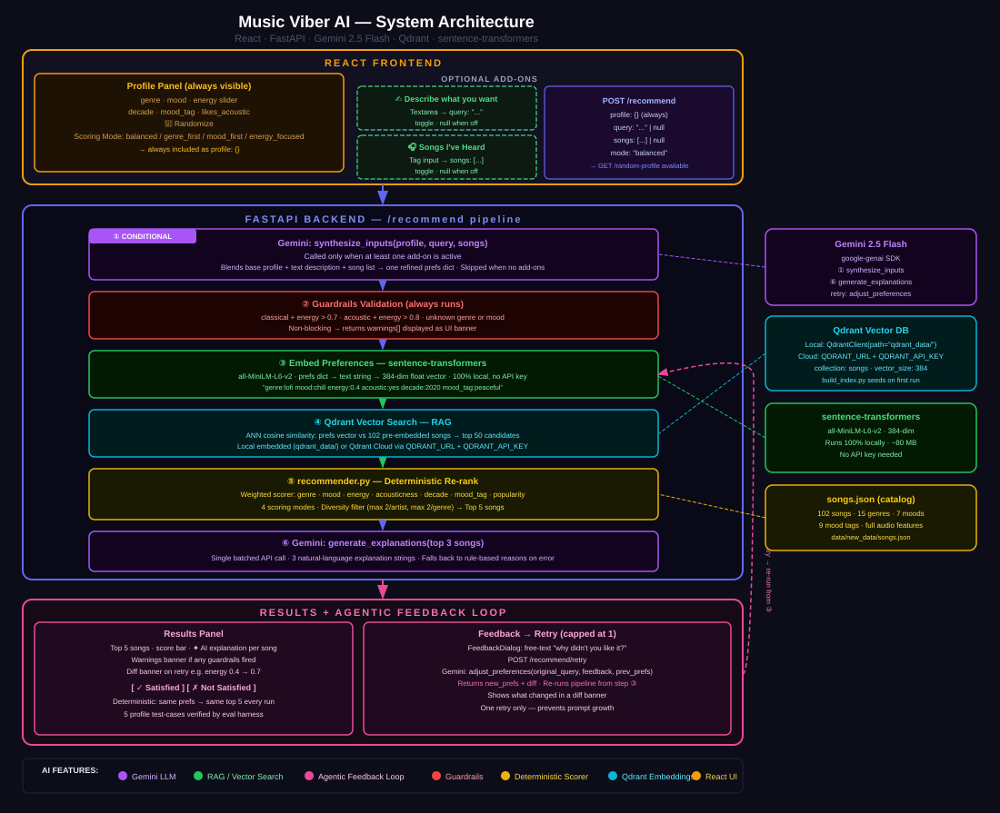

# Music Viber — AI-Powered Music Recommendation System

## Original Project

**Project Name:** Music Viber

<!-- 2-3 sentences: what it did, what its goals were, and what it could do -->

Music Viber was a music recommendation system that recommends music to the users based on their user profile. User profile contained some characteristics like genre score, mood, energy, and so on. Based on the user profile and the recommendation mode (like genre-first, balance, or mood-first recommendation) the uses to cross check every single song stored in a custom file, and giv it a score, rerank the list, diversity the list with deterministic algorithm to finally generate the recommendation.

The problem with the previous version was it alwasy generated the same recommendation if the profile was same, the algorithm to find the match was very general, it did not consider the relationship between different genres, and it didnot have a feedback system.

---

## Title & Summary

<!-- What the final project does and why it matters -->

Title: Music Viber AI a.k.a MVI


MVI is an advance AI-powered recommendation platform with feedback enabled. The user provides certain details by which the AI system generates a profile for that user. The generated profile is checked by guardrails. After the following. The profile is sent along with system prompt for a vector search where the qdrant vectorDB responds with semantically similar songs. The songs are reranked using deterministic algorithms with MMR diversification to generate the final list. Now, if the user is unsatisfied with the response it can give a feed and retry the generation.

The new version introduces reliable way to generate user profile, implements feedback system, uses more amount of user data and songs, and implements advance diversification techniques.


---

## Architecture Overview



<!-- Short explanation of how data flows through your system — user input → backend → AI layer → response -->

Step 1 :  User inputs the data
            - there are three types of input
                - User profile
                - User custom prompt
                - List of songs you have listened
Step 2:  Backend receives the input
            - Gemini takes data and builds a profile

Step 3:  Guardrails check

Step 4:  The profile is embedded

Step 5:  The vector embeddings is sent to VectorDB 

Step 6:  Recommender.py reranks the returned results from Vector Search

Step 7:  Re-ranks via MMR diversificatoin

Step 8:  Results returned. 

Step 9:  If given feedback, the system repeats.


---

## Setup Instructions

### Prerequisites

<!-- List anything that needs to be installed first (Python version, Node, Docker, etc.) -->

### Backend

```bash
# 1. Create and activate a virtual environment
python -m venv .venv
source .venv/bin/activate      # Mac/Linux
.venv\Scripts\activate         # Windows

# 2. Install dependencies
pip install -r requirements.txt

# 3. Copy and fill in your environment variables
cp .env.example .env

# 4. Build the Qdrant vector index
python scripts/build_index.py  # This is important step

# 5. Open another tab in the terminal and Start the backend server 
uvicorn server.app:app --reload

# Alternative — no activation needed (use full path to .venv's uvicorn)
.venv/bin/uvicorn server.app:app --reload        # Mac/Linux
.venv\Scripts\uvicorn server.app:app --reload    # Windows
```

### Frontend

```bash
cd client
npm install
npm run dev
```

The app will be available at `http://localhost:5173`. The API runs on `http://localhost:8000`.

---

## Sample Interactions

### Example 1 — Natural Language Input

**Input:**
```
<!-- paste the text input you gave the system -->
```

**AI Output:**
```
<!-- paste the recommendations and explanation the system returned -->
```

---

### Example 2 — Structured Profile Input

**Input:**
```json
{
  "genre": "",
  "mood": "",
  "energy": 0.0,
  "likes_acoustic": false
}
```

**AI Output:**
```
<!-- paste the recommendations and explanation the system returned -->
```

---

### Example 3 — Edge Case / Guardrail Triggered

**Input:**
```
<!-- paste an input that triggers a guardrail warning -->
```

**AI Output:**
```
<!-- paste the warning message and how the system handled it -->
```

---

## Design Decisions

<!-- Why you built it this way. Cover: LLM choice, vector DB choice, why you kept the original re-ranker, what you deferred and why -->

| Decision | Choice | Reason |
|---|---|---|
| LLM | Gemini | <!-- why --> |
| Vector DB | Qdrant | <!-- why --> |
| Re-ranker | `src/recommender.py` | <!-- why --> |
| Deferred | Spotify Audio Features API | Deprecated for new apps |

---

## Testing Summary

MVI uses three layers of tests that mirror the architecture of the system.

### Layer 1 — Routing Tests
Basic endpoint checks with no external dependencies. Verifies that `/health`
returns `200`, `/random-profile` returns all required keys, and that energy
values stay within the valid `0.0–1.0` range. These run instantly and require
no API keys or environment setup.

### Layer 2 — Pipeline Tests (`_run_pipeline`)
Tests the core logic of the system with all external services mocked
(Gemini, Qdrant, sentence-transformers). Each test patches only what it
needs and lets the real `recommend_songs` and `mmr_rerank` run. This layer
covers:

- **Happy path** — full flow returns `results` and `warnings`
- **Top 5 explanations** — Gemini-generated sentences appear on results 1–5
- **Results 6–10** — fall back to rule-based reasons from the scorer
- **Qdrant down** — if embedding or vector search crashes, the system falls
  back to the full JSON catalog without returning an error
- **MMR failure** — if MMR reranking crashes, the system falls back to the
  deterministic diversity filter in `recommend_songs`
- **Guardrail warnings** — warnings from `validate_preferences` are
  surfaced in the response, not swallowed

### Layer 3 — Endpoint + Gemini Tests
Tests each of the five API endpoints through FastAPI's `TestClient`, with
Gemini mocked at the `server.app` import level. Covers:

- `/recommend/from-text` — Gemini parses the query; crashes return `422`
- `/recommend/from-songs` — Gemini infers preferences from song names; empty
  list returns `422`
- `/recommend/from-profile` — skips Gemini entirely; confirmed via
  `assert_not_called()`
- `/recommend/retry` — `adjust_preferences` result is passed back as `diff`
  in the response
- `/recommend` — calls `synthesize_inputs` only when a query or song list is
  present; skips it for plain profile requests

### Test Files

| File | What It Covers |
|---|---|
| `tests/test_recommender.py` | Original scorer: sorting, scoring modes, diversity filter |
| `tests/test_guardrails.py` | Preference validation edge cases |
| `tests/test_app.py` | All three layers above (18 tests) |

**What worked:** <!-- fill in -->

**What didn't work:** <!-- fill in -->

**What you learned:** <!-- fill in -->

---

## Guardrails

MVI validates every generated preference profile before it reaches the vector
search. The guardrail layer runs after Gemini parses the user's input and
before the embedding is created. It is non-blocking — warnings are collected
and returned to the frontend alongside the results, so the system never
refuses a request.

### What is checked

| Check | Condition | Warning returned |
|---|---|---|
| Classical + high energy | `genre == "classical"` and `energy > 0.7` | Only 1 classical song in catalog, results may be poor |
| Acoustic + high energy conflict | `likes_acoustic == True` and `energy > 0.8` | Most acoustic songs are low energy, results may conflict |
| Unknown genre | `genre` not in the 15 known genres | Genre not in catalog, results may be empty |
| Unknown mood | `mood` not in the 7 known moods | Mood may not match any songs directly |
| Energy out of range | `energy` outside `0.0–1.0` | Energy must be between 0.0 and 1.0 |

### Known genres
`pop`, `lofi`, `rock`, `ambient`, `jazz`, `synthwave`, `indie pop`,
`hip-hop`, `r&b`, `classical`, `edm`, `country`, `folk`, `reggae`, `metal`

### Known moods
`happy`, `chill`, `intense`, `relaxed`, `focused`, `moody`, `calm`

### Why non-blocking
A blocking guardrail would refuse requests when Gemini picks a valid-sounding
but slightly off value. Since the catalog is small (edge cases like classical
or metal only have a handful of songs), it is more useful to warn the user
and show imperfect results than to return nothing.


---

## Reflection

<!-- What this project taught you about AI and problem-solving. Be honest and specific — this is the section employers actually read. -->
