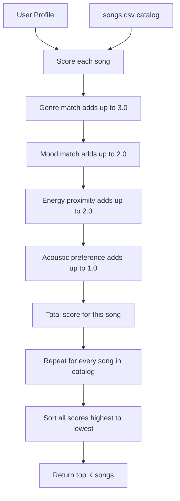
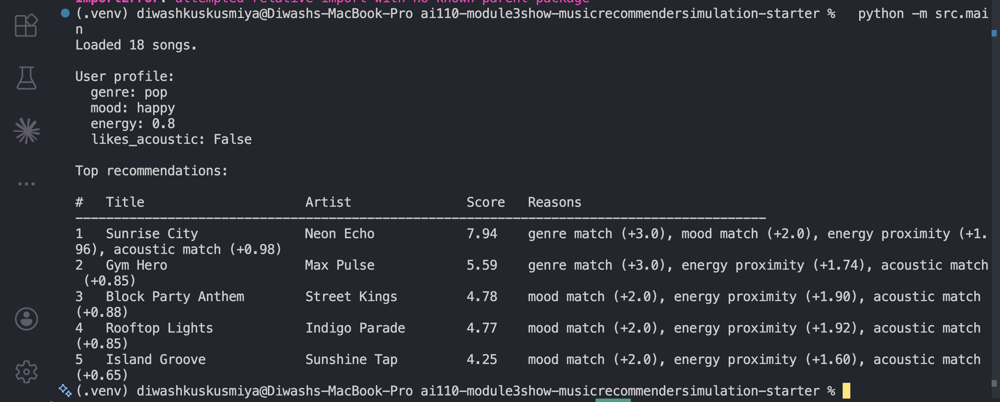
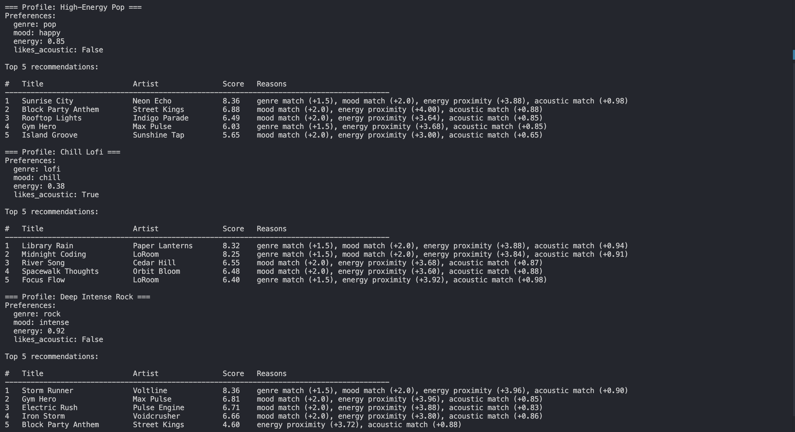
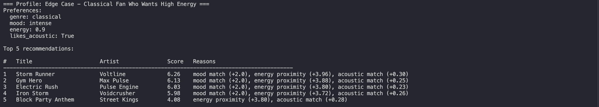

# 🎵 Music Recommender Simulation

## Project Summary

In this project you will build and explain a small music recommender system.

Your goal is to:

- Represent songs and a user "taste profile" as data
- Design a scoring rule that turns that data into recommendations
- Evaluate what your system gets right and wrong
- Reflect on how this mirrors real world AI recommenders

This project builds a content-based music recommender that scores songs from an 18-track catalog against a user's taste profile and returns the top 5 matches. It supports four scoring modes, a diversity filter to avoid repetitive results, and outputs a formatted table showing each recommendation's score and the reasons behind it.

---

## How The System Works

Real-world music platforms like Spotify and TikTok mostly rely on two approaches to figure out what you might want to hear next.

The first is collaborative filtering, which basically says "people who liked what you liked also liked this." It looks at the behavior of millions of users (plays, skips, likes, playlist adds) and finds patterns without actually knowing anything about the songs themselves. Spotify's Discover Weekly works this way.

The second is content-based filtering, which says "this song has similar attributes to songs you already enjoy." It looks directly at the song's features like genre, energy, and tempo and compares them to what a user prefers. TikTok mixes this with engagement signals like how long you watch a video before scrolling.

This simulator uses content-based filtering. It takes a user's taste preferences, scores every song based on how well it matches, and returns the top results.

**What each Song tracks:**

- genre - the musical category (pop, lofi, rock, ambient, etc.)
- mood - the emotional tone (happy, chill, intense, relaxed, focused, moody)
- energy - how loud and intense the song feels, on a scale from 0.0 to 1.0
- tempo_bpm - beats per minute
- valence - how positive or joyful the song sounds, from 0.0 (dark) to 1.0 (bright)
- danceability - how easy it is to dance to, from 0.0 to 1.0
- acousticness - how acoustic vs electronic the song is, from 0.0 to 1.0

**What each UserProfile stores:**

- favorite_genre - the genre they prefer most
- favorite_mood - the mood they usually listen for
- target_energy - the energy level they want (0.0 to 1.0)
- likes_acoustic - whether they prefer acoustic sounds over electronic ones

**How a song gets scored:**

Each song gets a score based on how well it matches the user. Genre match is worth the most (weight 3.0) because it's the clearest signal of what someone is in the mood for. Mood match comes second (weight 2.0) since the emotional vibe matters a lot. Energy is scored by proximity (weight 2.0) meaning a song that's close to your target energy scores better than one that's very far off, using the formula 1 minus the absolute difference. Acoustic preference gets a smaller weight (1.0) as a bonus when the song's acoustic feel lines up with what the user wants.

**How the final list is built:**

Every song in the catalog gets scored individually. Then the list is sorted from highest to lowest score, and the top k songs are returned as recommendations.

**Example user profile this system was designed around:**

- favorite_genre: pop
- favorite_mood: happy
- target_energy: 0.8
- likes_acoustic: False

**Algorithm Recipe (exact weights):**

- Genre match - +3.0 points (all or nothing, either it matches or it doesn't)
- Mood match - +2.0 points (same, binary)
- Energy proximity - up to +2.0 points, calculated as 2.0 times (1 minus the difference between target energy and song energy)
- Acoustic preference - up to +1.0 points, based on how close the song's acousticness is to what the user wants

The maximum a song can score is 8.0. A perfect match on genre, mood, energy, and acoustic feel all at once.

**Data flow:**



**Known biases to watch for:**

Genre has the highest weight, which means a mediocre pop song will almost always beat a great jazz song for a user who listed pop as their favorite. The system never suggests anything outside the stated genre unless the catalog is small enough that genre matches run out. This is called a filter bubble, and it is a real problem in production recommenders too. Mood is the second biggest factor, so a song with a mismatched mood (like an intense track for a user who wants chill) gets heavily penalized even if everything else lines up.

---

## Getting Started

### Setup

1. Create a virtual environment (optional but recommended):

   ```bash
   python -m venv .venv
   source .venv/bin/activate      # Mac or Linux
   .venv\Scripts\activate         # Windows

2. Install dependencies

```bash
pip install -r requirements.txt
```

3. Run the app:

```bash
python -m src.main
```

### Running Tests

Run the starter tests with:

```bash
pytest
```

You can add more tests in `tests/test_recommender.py`.

---

## Experiments You Tried







The experiment doubled the energy weight from 2.0 to 4.0 and halved the genre weight from 3.0 to 1.5 to test whether energy is a stronger taste signal than genre.

- High-Energy Pop: Sunrise City ranked first as expected (genre + mood + close energy). Block Party Anthem came in second despite being hip-hop, purely because its energy was a perfect match. The weight shift is working — a genre mismatch no longer kills a song's ranking if everything else lines up.
- Chill Lofi: The two lofi songs ranked at the top and the acoustic bonus visibly helped. This profile produced the most accurate-feeling results.
- Deep Intense Rock: Storm Runner (the only rock song) ranked first easily. Slots 2 through 4 were filled by EDM and metal songs, not rock — there simply aren't enough rock songs in the catalog to fill a full top 5.
- Edge Case (classical + high energy): Morning Sonata, the only classical song, did not appear in the top 5 at all. Its energy of 0.18 is so far from the user's target of 0.90 that the genre match could not compensate. Storm Runner ranked first instead. The system had no way to handle the contradiction — it just picked the least-bad option.

---

## Limitations and Risks

- The catalog only has 18 songs, so some genres like rock and classical have just one track each, which is not enough to produce meaningful variety.
- The system has no memory. It cannot learn from skips, replays, or any real listening behavior, so it produces the same output every time for the same profile.
- Genre carries the most weight, which creates a filter bubble. Users will almost always get songs from their stated genre even when other genres would match their mood and energy better.
- Tempo, valence, and danceability are tracked but not used in scoring, so a lot of available signal is wasted.
- The system cannot handle contradictory preferences. A classical fan who wants high energy will get metal songs because the math has no way to flag the conflict.

---

## Reflection

Read and complete `model_card.md`:

[**Model Card**](model_card.md)

Building this recommender made it clear how much a single design choice — like giving genre 3x the weight of any other feature — shapes everything the system produces. A user who lists "rock" as their favorite genre will mostly get rock songs, even if the only rock song in the catalog has nothing else in common with what they want. That is exactly how filter bubbles form in real apps: the system keeps confirming the preference it already knows about and never takes a risk on something different.

The experiment of halving the genre weight and doubling the energy weight made the results feel more diverse and in some cases more accurate. The EDM profile and the lofi profile both got better results, which suggests that energy level might actually be a stronger signal of musical mood than the genre label. The part that surprised me most was the edge case profile — a classical fan who wants high energy. The system had no way to handle that contradiction, so it ended up recommending metal songs. A real recommender would surface that conflict or learn from the user's actual listening behavior that their stated preferences do not fully reflect their taste.

**Profile comparison notes:**

- High-Energy Pop vs Chill Lofi: the pop profile gets high danceability and upbeat songs, the lofi profile gets quiet and acoustic tracks. The mood and energy weights are doing most of the work here — the genre match just confirms what the energy already predicted.
- Deep Intense Rock vs Edge Case Classical: both want high energy, but only rock has a matching genre song. The classical user ends up with the same high-energy results as the rock user minus the one genre match, which shows that when genre is rare in the catalog, energy basically takes over the ranking entirely.


---

## 7. `model_card_template.md`

Combines reflection and model card framing from the Module 3 guidance.

```markdown
# 🎧 Model Card - Music Recommender Simulation

## 1. Model Name

Give your recommender a name, for example:

Music Viber

---

## 2. Intended Use

This system suggests up to 5 songs from an 18-song catalog by scoring each track against a user's preferred genre, mood, energy level, acoustic taste, decade, and mood tag. It is built for classroom exploration of how content-based filtering works and is not intended for real users or production environments.

---

## 3. How It Works (Short Explanation)

Every song in the catalog gets a score based on how closely it matches what the user said they like. The system looks at the song's genre, mood, energy level, how acoustic it sounds, how popular it is, what decade it came from, and its detailed mood tag. On the user side, it takes their favorite genre, preferred mood, target energy, acoustic preference, preferred decade, and mood tag. It then adds up points for each match or near-match, sorts every song from highest to lowest score, and hands back the top 5. Think of it like a checklist where each item is worth a different number of points.

---

## 4. Data

There are 18 songs in the catalog. The original starter file had 10, and 8 more were added to cover genres that were missing, like hip-hop, r&b, classical, edm, country, folk, reggae, and metal. The moods covered include happy, chill, intense, relaxed, focused, moody, and calm. The data was created manually for this simulation, so it mostly reflects a general western music taste and does not represent any real listening history or cultural diversity.

---

## 5. Strengths

It works best when the user's preferred genre has more than one song in the catalog. The lofi profile was the most satisfying result. Library Rain and Midnight Coding came up first and it genuinely felt right. The system is also completely transparent, every recommendation shows exactly why it scored the way it did. That makes it easy to understand.

---

## 6. Limitations and Bias

Genre has the highest weight so users almost always get songs from their stated genre even when a song from a different genre would fit their mood and energy perfectly. That is a filter bubble. The system also treats every user the same way, same weights, same formula so it cannot adapt to someone whose taste is more nuanced or complex. If used in a real product it would likely push users deeper into one genre over time and never introduce them to anything new which is exactly the kind of bias that makes real recommendation systems feel repetitive after a while.

---

## 7. Evaluation

Four profiles were tested: a high-energy pop fan, a chill lofi listener, a deep rock fan, and an edge case of a classical fan who wanted high energy. The lofi and pop profiles felt accurate. The rock profile was weak because only one rock song exists in the catalog. The edge case broke the system. It recommended metal songs to a classical fan because the energy gap on the only classical song was too large to recover from. A weight shift experiment was also run where energy was doubled and genre was halved.

---

## 8. Future Work

The catalog needs to grow. 18 songs is not enough for most genres to feel fairly represented. Using tempo and valence in the scoring would also help since both affect how a song feels but are currently ignored. Adding a feedback loop where skips and replays adjust the user profile over time would make the system actually learn, which is the biggest missing piece compared to how real recommenders work.

---

## 9. Personal Reflection

I did not expect a single weight value to have such a visible effect on the output. Changing genre from 3.0 to 1.5 shifted the entire character of the results across every profile. A lot of what makes a real recommender feel smart or dumb is just a handful of numbers someone decided on. The edge case was the most interesting moment. Seeing a classical fan get recommended metal songs made it obvious that the system has no real understanding of what it is doing, it is just math. Human judgment still matters when preferences contradict each other, when the catalog is missing something, or when a user wants to be surprised rather than just confirmed.
```
