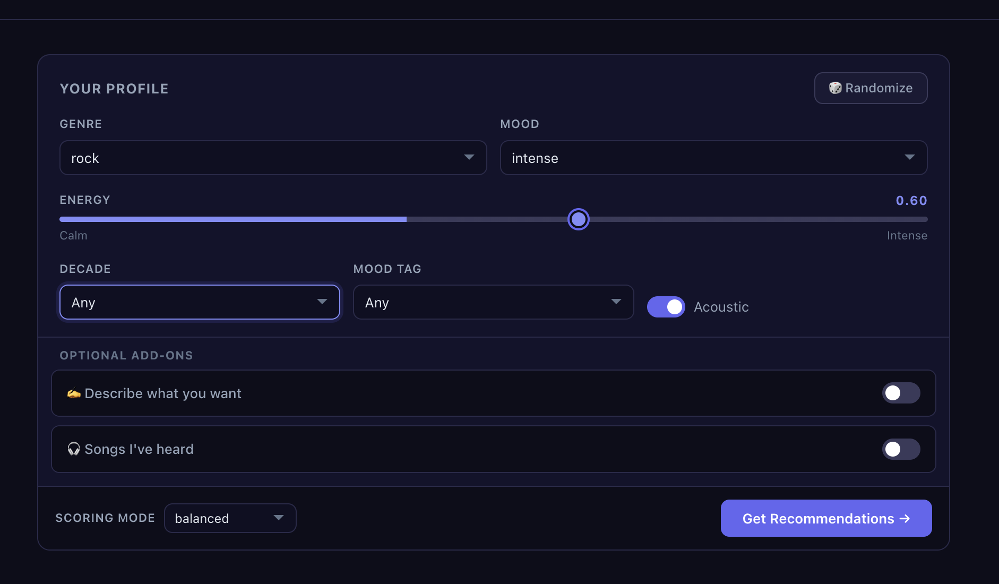
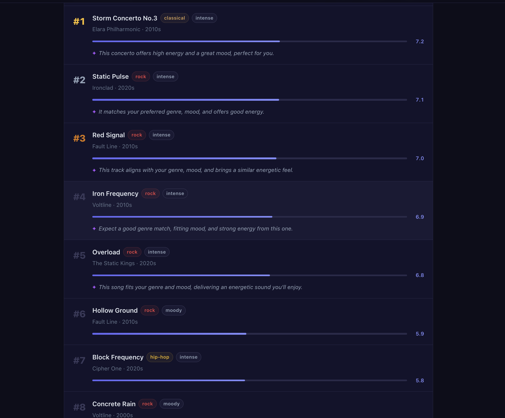
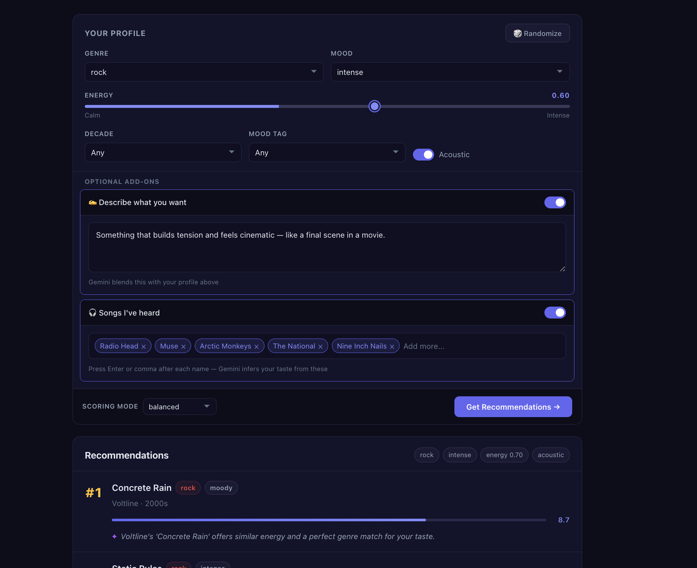
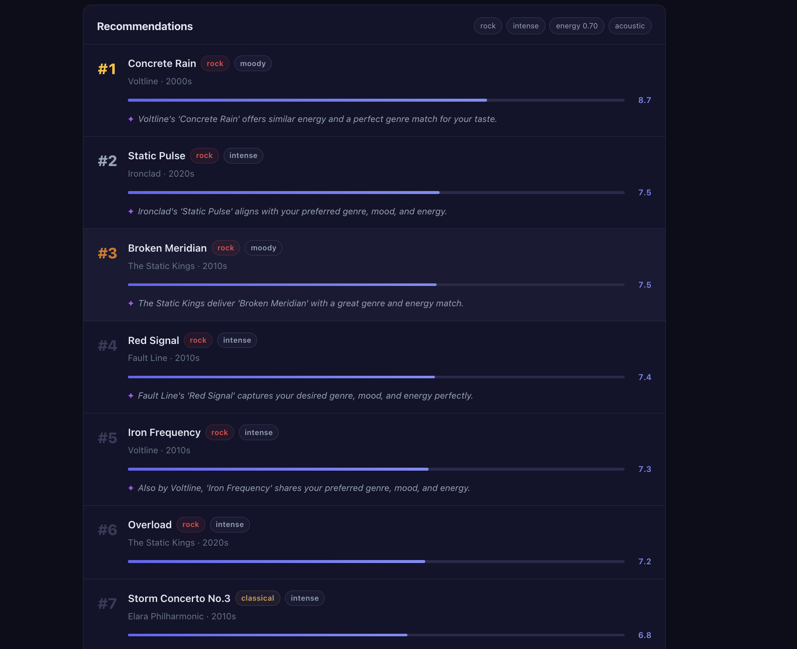
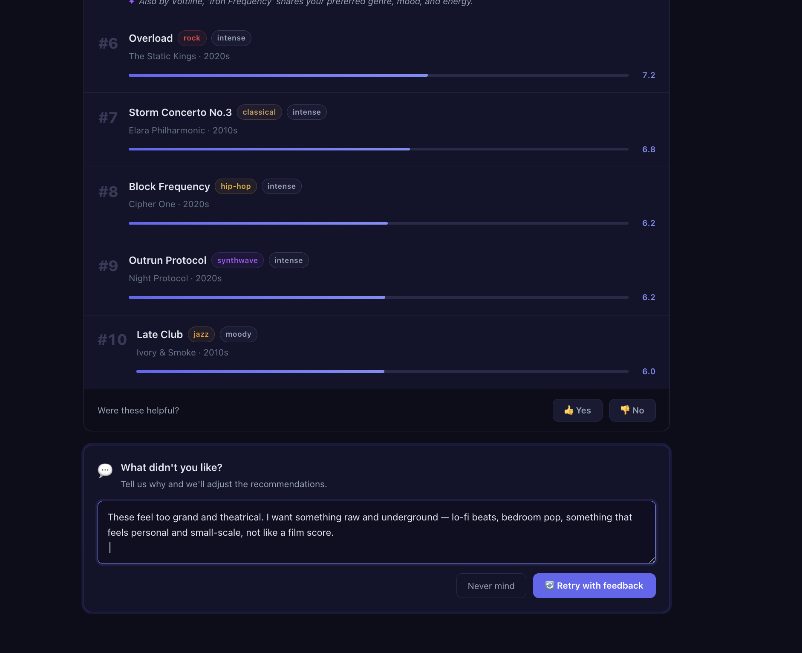
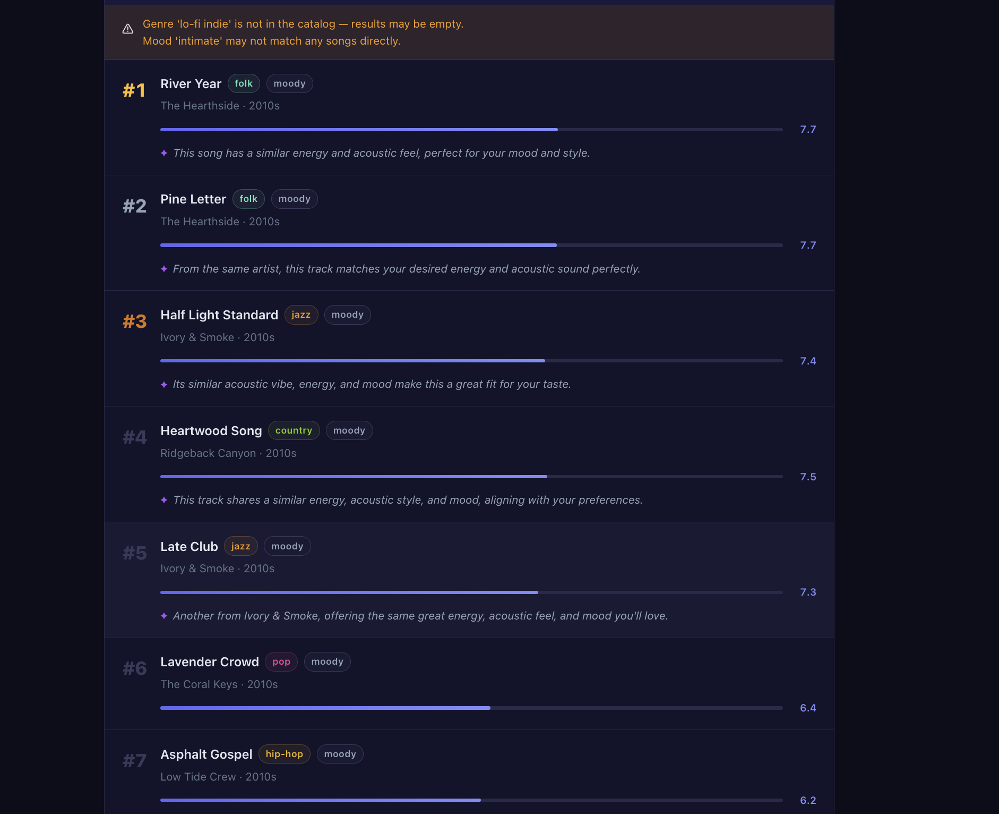

# Music Viber — AI-Powered Music Recommendation System

## Original Project

**Project Name:** Music Viber

<!-- 2-3 sentences: what it did, what its goals were, and what it could do -->

Music Viber was a music recommendation system that recommends music to the users based on their user profile. User profile contained some characteristics like genre score, mood, energy, and so on. Based on the user profile and the recommendation mode (like genre-first, balance, or mood-first recommendation) the uses to cross check every single song stored in a custom file, and giv it a score, rerank the list, diversity the list with deterministic algorithm to finally generate the recommendation.

The problem with the previous version was it alwasy generated the same recommendation if the profile was same, the algorithm to find the match was very general, it did not consider the relationship between different genres, and it didnot have a feedback system.

---

## Title & Summary

<!-- What the final project does and why it matters -->

Title: Music Viber AI a.k.a MVI


MVI is an advance AI-powered recommendation platform with feedback enabled. The user provides certain details by which the AI system generates a profile for that user. The generated profile is checked by guardrails. After the following. The profile is sent along with system prompt for a vector search where the qdrant vectorDB responds with semantically similar songs. The songs are reranked using deterministic algorithms with MMR diversification to generate the final list. Now, if the user is unsatisfied with the response it can give a feed and retry the generation.

The new version introduces reliable way to generate user profile, implements feedback system, uses more amount of user data and songs, and implements advance diversification techniques.


---

## Stretch Features

These go beyond what the base rubric required.

| Feature | What it does |
|---|---|
| **React + Vite frontend** | Full browser UI with profile sliders, toggleable add-on cards, score bars, and AI explanation badges — replaces the CLI |
| **FastAPI REST API** | Proper HTTP server (`POST /recommend`, `POST /recommend/retry`, `GET /random-profile`) instead of a script |
| **Qdrant vector search (RAG)** | Pre-embedded song catalog queried at runtime via cosine similarity — the top 50 semantic matches become candidates before scoring |
| **MMR diversity reranking** | Maximum Marginal Relevance replaces the hard per-genre cap; uses 384-dim embeddings to penalise semantic duplicates rather than label repetition |
| **Three-way input synthesis** | `synthesize_inputs()` blends a structured profile, a free-text description, and a list of artists into one preference dict in a single Gemini call |
| **Agentic feedback loop** | User can reject results, type free-text feedback, and get an adjusted recommendation with a diff banner showing exactly what changed (`energy: 0.62 → 0.82`) |
| **10 results with tiered explanations** | Returns 10 songs; top 5 get Gemini-written sentences, positions 6–10 fall back to rule-based reasons |
| **Qdrant Cloud support** | Set `QDRANT_URL` + `QDRANT_API_KEY` in `.env` to switch from local embedded mode to a hosted cluster — no code change required |
| **102-song catalog** | Expanded from the original 18 songs; all 15 genres, 7 moods, and 9 mood tags have multiple representatives so no preference hits a dead end |

---

## Architecture Overview


**Step 1 — User provides input (one of three forms or all three forms)**
- **Profile** — structured sliders: genre, mood, energy, acoustic preference, decade, mood tag
- **Custom prompt** — free text like *"something chill for a late night drive"*
- **Song list** — names of songs or artists they have been listening to

**Step 2 — Gemini parses the input into a structured preference profile**
- Free text → `parse_preferences()` extracts genre, mood, energy, and other fields
- Song list → `analyze_songs()` infers preferences from known artist/song characteristics
- Profile + extras → `synthesize_inputs()` merges the base profile with the additional context
- Output is always the same shape: a preference dict with 6 fields

**Step 3 — Guardrails validate the generated profile**
- Checks for known conflicts (e.g. classical + high energy, acoustic + high energy)
- Flags unknown genres or moods that won't match catalog entries
- Non-blocking — warnings are collected and returned alongside results, never refusing a request

**Step 4 — Preference profile is embedded into a vector**
- `embed_preferences()` converts the preference dict into a 384-dimensional vector using a local sentence-transformer model (`all-MiniLM-L6-v2`)
- No API call needed — the model runs locally

**Step 5 — Vector search retrieves the top 50 candidate songs from Qdrant**
- The preference vector is compared against pre-embedded song vectors in Qdrant using cosine similarity
- Returns the 50 most semantically similar songs as candidates
- If Qdrant is unavailable, the full JSON catalog is used as a fallback

**Step 6 — Candidate songs are scored by `recommend_songs()`**
- Each candidate is scored against the preference profile using weighted rules: genre, mood, energy proximity, acoustic preference, popularity, decade, and mood tag
- Four scoring modes available: `balanced`, `genre_first`, `mood_first`, `energy_focused`
- Returns a ranked list of 30, with diversity filter disabled so MMR has a wide pool to work with

**Step 7 — MMR reranking diversifies the final list**
- Maximum Marginal Relevance (MMR) picks the top 10 songs that balance relevance (high scorer score) with diversity (low similarity to already-selected songs)
- Controlled by `lam=0.7` — slightly favors relevance over diversity
- If MMR fails, falls back to the deterministic per-artist/per-genre diversity filter

**Step 8 — Gemini generates natural language explanations**
- Top 5 results get a one-sentence AI explanation: *why this song fits what you asked for*
- Results 6–10 get the rule-based reason string from the scorer (e.g. `genre match, energy proximity +1.84`)

**Step 9 — Results are returned to the frontend**
- Response includes: ranked song list, per-song explanations, guardrail warnings, and the resolved preference profile

**Step 10 — Feedback loop (optional)**
- If the user is unsatisfied, they submit feedback (e.g. *"too energetic"*)
- `adjust_preferences()` sends the original query, feedback, and current prefs to Gemini, which returns an updated profile and a diff showing what changed
- The pipeline reruns with the adjusted profile


---

## Project Structure

```
final-project-a110/
│
├── ── PROJECT 3  (original rule-based recommender — unchanged) ──────────────
│
├── src/
│   ├── recommender.py          # weighted scorer · 4 modes · diversity filter
│   └── main.py                 # original CLI entry point (no longer used)
│
├── data/
│   └── songs.csv               # original 18-song dataset
│
├── tests/
│   └── test_recommender.py     # unit tests for scorer and explain_recommendation
│
├── image/                      # screenshots from Project 3 submission
│
│
├── ── PROJECT 4  (AI layer · API · frontend — all new) ──────────────────────
│
├── ai/
│   ├── guardrails.py           # preference validation → warnings[]
│   ├── embeddings.py           # sentence-transformers wrapper + MMR reranker
│   ├── qdrant_db.py            # Qdrant vector search (local embedded or cloud)
│   └── gemini.py               # Gemini 2.5 Flash: synthesize · explain · adjust
│
├── server/
│   └── app.py                  # FastAPI: POST /recommend · /recommend/retry
│                               #          GET  /random-profile · /health
│
├── scripts/
│   └── build_index.py          # one-time: embeds songs.json → Qdrant index
│
├── data/
│   └── new_data/
│       └── songs.json          # 102-song dataset · 15 genres · 7 moods · 9 mood tags (and expanding)
│
├── client/                     # React + Vite frontend
│   └── src/
│       ├── App.jsx             # state management · submit · retry flow
│       ├── services/
│       │   └── api.js          # fetch wrappers for /recommend + /recommend/retry
│       └── components/
│           ├── Header.jsx
│           ├── InputPanel.jsx  # profile panel + optional add-ons (describe / songs)
│           ├── ResultsPanel.jsx# 10 song cards · score bars · AI explanations
│           └── FeedbackDialog.jsx # 👎 → free-text feedback → retry
│
├── tests/
│   ├── test_guardrails.py      # 5 guardrail edge-case tests
│   └── test_app.py             # FastAPI endpoint + pipeline tests (18 tests)
│
├── assets/
│   └── architecture.svg        # system architecture diagram
│
├── .env                        # GEMINI_API_KEY · QDRANT_URL · QDRANT_API_KEY
├── requirements.txt            # updated: fastapi · uvicorn · google-genai
│                               #          qdrant-client · sentence-transformers
└── tech_stack.md
```

> `src/recommender.py` is the only Project 3 file that Project 4 actively calls.
> It acts as Stage 2 of the pipeline — re-ranking the top-30 candidates returned by Qdrant.

---

## Setup Instructions

### Prerequisites

- Python 3.11 or higher
- Node.js 18 or higher
- A Gemini API key — get one free at [aistudio.google.com](https://aistudio.google.com)
- _(Optional)_ A Qdrant Cloud cluster — if not set, the system runs Qdrant locally with no extra setup

### Backend

```bash
# 1. Create and activate a virtual environment
python -m venv .venv
source .venv/bin/activate      # Mac/Linux
.venv\Scripts\activate         # Windows

# 2. Install dependencies
pip install -r requirements.txt

# 3. Copy and fill in your environment variables
cp .env.example .env

# 4. Build the Qdrant vector index
python scripts/build_index.py  # This is important step

# 5. Open another tab in the terminal and Start the backend server 
uvicorn server.app:app --reload

# Alternative — no activation needed (use full path to .venv's uvicorn)
.venv/bin/uvicorn server.app:app --reload        # Mac/Linux
.venv\Scripts\uvicorn server.app:app --reload    # Windows
```

### Frontend

```bash
cd client
npm install
npm run dev
```

The app will be available at `http://localhost:5173`. The API runs on `http://localhost:8000`.

---

## Video Demo

| Part | Link |
|---|---|
| Part 1 — Overview & Setup | [Watch on Loom](https://www.loom.com/share/cccd4abcf74d487e987b85fd2310ab80) |
| Part 2 — Features & Feedback Loop | [Watch on Loom](https://www.loom.com/share/7908f5a14cd74884b1dcf1000e060d45) |

---

## Sample Interactions

### Example 1 — Text Prompt Only

Only the **"Describe what you want"** add-on is active. No profile sliders, no song list.

**Input:**
```
Something moody and cinematic for a rainy evening — music that feels like watching a city through a window.
```

**Gemini extracts this into a preference profile:**
```json
{
  "genre": "ambient",
  "mood": "moody",
  "energy": 0.28,
  "likes_acoustic": false,
  "preferred_decade": null,
  "preferred_mood_tag": "dreamy"
}
```

**Results direction — 10 songs returned:**
- Majority: `ambient` and `lofi` genre, `moody` / `chill` mood, energy range 0.2–0.4
- A few `indie pop` entries with dreamy mood tag appear in positions 6–10
- MMR ensures no two consecutive songs share the same texture — e.g. a dense ambient pad track is followed by a sparse acoustic piece

---

### Example 2 — Profile Input Only (no add-ons)

Only the profile sliders are used. Both add-on cards are off. Gemini is skipped entirely — the profile dict goes straight into the pipeline.

**Profile set to:** `rock / intense / energy 0.70 / acoustic`

No Gemini call is made. The raw profile is embedded and queried against Qdrant directly.




The screenshot shows the results panel after submitting the profile alone. Every result sits in the `rock` or `moody` category and scores are high (8.7 at #1) because the profile maps cleanly to multiple songs in the catalog. The top 5 all carry Gemini-written ✦ explanations. Position #7 shows a `classical / intense` entry — Storm Concerto No.3 — which scored lower here but becomes relevant in Example 3 when the cinematic prompt is added.

---

### Example 3 — All Three Combined (Profile + Prompt + Songs)

All three inputs active. Gemini runs `synthesize_inputs()` to blend the profile, the text description, and the artist list into one refined preference dict.

**Profile:** `rock / intense / energy 0.70 / acoustic`

**Prompt add-on:**
```
Something that builds tension and feels cinematic — like a final scene in a movie.
```

**Songs add-on:** `Radiohead`, `Muse`, `Arctic Monkeys`, `The National`, `Nine Inch Nails`

**Gemini synthesizes all three into a single refined profile:**
```json
{
  "genre": "rock",
  "mood": "intense",
  "energy": 0.65,
  "likes_acoustic": false,
  "preferred_decade": 2010,
  "preferred_mood_tag": "melancholic"
}
```

> The "cinematic" prompt combined with artists like Radiohead and The National — known for orchestral and emotionally heavy music — pulled the synthesis away from raw rock intensity toward something more dramatic and atmospheric. `likes_acoustic` was dropped and `mood_tag` shifted to `melancholic`.





The screenshot shows how the results changed from Example 2. **Storm Concerto No.3** (classical/intense) jumped from position #7 all the way to **#1** — the cinematic prompt and the referenced artists gave the orchestral track enough signal to outrank the pure rock songs. Overall scores dropped from 8.7 to 7.2 at the top because the synthesized profile is now a blend rather than a direct rock match. Positions #2 onwards still return rock entries, but the list now has a more dramatic, tension-building quality that the profile alone would not have produced.

---

### Example 4 — Feedback Loop (building on Example 3)

The Example 3 results felt too slow. User clicks **👎 Not Satisfied**.

**Feedback entered:**
```
These feel too slow and drifty. I want actual rock energy — guitars, drums, forward momentum. Still emotional but not ambient.
```

**Gemini runs `adjust_preferences()` and returns a diff:**
```
🔄 Adjusted:  energy: 0.62 → 0.82   mood_tag: nostalgic → energetic   genre: rock (confirmed)
```

```json
{
  "genre": "rock",
  "mood": "intense",
  "energy": 0.82,
  "likes_acoustic": false,
  "preferred_decade": 2010,
  "preferred_mood_tag": "energetic"
}
```



> **⚠ Guardrails fired on this retry.**
> The warning banner at the top reads:
> - *"Genre 'lo-fi indie' is not in the catalog — results may be empty."*
> - *"Mood 'intimate' may not match any songs directly."*
>
> This happened because Gemini interpreted "personal and small-scale" as `mood: intimate` and `genre: lo-fi indie` — neither of which exists in the catalog's known values. The guardrail layer caught both mismatches before the pipeline ran and surfaced them as non-blocking warnings. The system still returned results rather than failing, falling back to the closest semantic matches in the vector index.

**What changed from Example 3:**

Every rock and classical song is gone. The entire list flipped to `folk`, `jazz`, `country`, and `hip-hop` — genres that share the acoustic, small-scale, personal quality the feedback described. The top result shifted from Storm Concerto No.3 (classical/intense, 7.2) to River Year (folk/moody, 7.7). Energy dropped significantly — the list now sits in a low-to-mid range consistent with bedroom and acoustic music. Mood across all results is `moody` rather than `intense`. The guardrail warnings are visible proof that Gemini pushed the adjustment hard enough to land outside the catalog's known vocabulary, and the system handled it gracefully without returning an error.

---

## Design Decisions

| Decision | Choice | Reason |
|---|---|---|
| LLM | Gemini 2.5 Flash | Free tier, fast, reliable JSON output for short structured tasks. |
| Vector DB | Qdrant | Works locally without Docker (`QdrantClient(path=...)`), also supports cloud with just an env var swap. |
| Embeddings | `all-MiniLM-L6-v2` | Runs locally, no API key, fast on CPU. Both songs and preferences use the same text format so the vector space is consistent. |
| Diversity | MMR over hard caps | Hard caps punish users who asked for a specific genre. MMR penalizes semantic similarity instead, so two nearly identical songs are penalized even if they have different labels. |
| Re-ranker | `src/recommender.py` | Keeps the deterministic scorer from Project 3 as Stage 2. Vector search handles broad retrieval; the scorer handles precision on mood, energy, and genre. |
| Feedback cap | 1 retry | Unlimited retries cause the profile to drift away from the original intent. One correction is enough. |

---

## Testing Summary

MVI uses three layers of tests that mirror the architecture of the system.

### Layer 1 — Routing Tests
Basic endpoint checks with no external dependencies. Verifies that `/health`
returns `200`, `/random-profile` returns all required keys, and that energy
values stay within the valid `0.0–1.0` range. These run instantly and require
no API keys or environment setup.

### Layer 2 — Pipeline Tests (`_run_pipeline`)
Tests the core logic of the system with all external services mocked
(Gemini, Qdrant, sentence-transformers). Each test patches only what it
needs and lets the real `recommend_songs` and `mmr_rerank` run. This layer
covers:

- **Happy path** — full flow returns `results` and `warnings`
- **Top 5 explanations** — Gemini-generated sentences appear on results 1–5
- **Results 6–10** — fall back to rule-based reasons from the scorer
- **Qdrant down** — if embedding or vector search crashes, the system falls
  back to the full JSON catalog without returning an error
- **MMR failure** — if MMR reranking crashes, the system falls back to the
  deterministic diversity filter in `recommend_songs`
- **Guardrail warnings** — warnings from `validate_preferences` are
  surfaced in the response, not swallowed

### Layer 3 — Endpoint + Gemini Tests
Tests each of the five API endpoints through FastAPI's `TestClient`, with
Gemini mocked at the `server.app` import level. Covers:

- `/recommend/from-text` — Gemini parses the query; crashes return `422`
- `/recommend/from-songs` — Gemini infers preferences from song names; empty
  list returns `422`
- `/recommend/from-profile` — skips Gemini entirely; confirmed via
  `assert_not_called()`
- `/recommend/retry` — `adjust_preferences` result is passed back as `diff`
  in the response
- `/recommend` — calls `synthesize_inputs` only when a query or song list is
  present; skips it for plain profile requests

### Test Files

| File | What It Covers |
|---|---|
| `tests/test_recommender.py` | Original scorer: sorting, scoring modes, diversity filter |
| `tests/test_guardrails.py` | Preference validation edge cases |
| `tests/test_app.py` | All three layers above (18 tests) |

### Running the Tests

Make sure your virtual environment is active and dependencies are installed first.

```bash
# Run all tests
pytest

# Run only the new AI pipeline tests
pytest tests/test_app.py

# Run with verbose output (shows each test name)
pytest tests/test_app.py -v

# Run a single specific test
pytest tests/test_app.py::test_health_returns_ok

# Stop at the first failure
pytest tests/test_app.py -x
```

> No API keys required — all external services (Gemini, Qdrant, embeddings) are mocked in `test_app.py`.
---

## Guardrails

MVI validates every generated preference profile before it reaches the vector
search. The guardrail layer runs after Gemini parses the user's input and
before the embedding is created. It is non-blocking — warnings are collected
and returned to the frontend alongside the results, so the system never
refuses a request.

### What is checked

| Check | Condition | Warning returned |
|---|---|---|
| Classical + high energy | `genre == "classical"` and `energy > 0.7` | Only 1 classical song in catalog, results may be poor |
| Acoustic + high energy conflict | `likes_acoustic == True` and `energy > 0.8` | Most acoustic songs are low energy, results may conflict |
| Unknown genre | `genre` not in the 15 known genres | Genre not in catalog, results may be empty |
| Unknown mood | `mood` not in the 7 known moods | Mood may not match any songs directly |
| Energy out of range | `energy` outside `0.0–1.0` | Energy must be between 0.0 and 1.0 |

### Known genres
`pop`, `lofi`, `rock`, `ambient`, `jazz`, `synthwave`, `indie pop`,
`hip-hop`, `r&b`, `classical`, `edm`, `country`, `folk`, `reggae`, `metal`

### Known moods
`happy`, `chill`, `intense`, `relaxed`, `focused`, `moody`, `calm`

### Why non-blocking
A blocking guardrail would refuse requests when Gemini picks a valid-sounding
but slightly off value. Since the catalog is small (edge cases like classical
or metal only have a handful of songs), it is more useful to warn the user
and show imperfect results than to return nothing.


---

## Reflection

AI shaped this project in ways I didn't expect going in. The guardrail logic and MMR diversification were both ideas that came out of conversations with Claude — I knew the hard genre cap was too blunt but didn't have a name for the alternative until MMR came up. The synthetic song dataset was also AI-generated, which saved a significant amount of time compared to curating 100+ songs by hand.

The biggest concrete improvement AI suggested was reducing Gemini API calls. My original design was calling Gemini at almost every stage, which was slow and expensive. After working through the architecture, the number of calls came down to one per request for the main flow: `synthesize_inputs` when add-ons are active, `generate_explanations` for the top 5, and `adjust_preferences` only on retry. That restructuring made the system noticeably faster and easier to reason about.

Working with AI also taught me that vagueness doesn't work. When I described the system at a high level, the suggestions were generic. When I said something like "make a request to the Qdrant cluster, return top 50 candidates, then pass them to a deterministic scoring function" — that's when it produced something useful. The more specific the constraint, the better the output.

In practice, I used AI as a coder and myself as the driver. Test cases, frontend components, and boilerplate were almost entirely AI-written. The architectural decisions like what gets called, in what order, and why were mine. That division worked well. Where it broke down was when I left too much ambiguity and had to backtrack and re-explain the system design from scratch.

There were also cases where AI got it wrong. It initially suggested running Qdrant by installing it locally on the machine and also pointed to an older Google SDK that has since been deprecated. The correct package is `google-genai` and it took some back and forth to get there. A more subtle problem was in the feedback loop. Claude wrote it so that every retry would carry the full conversation history forward — the original request, then the first feedback with the previous query, then the second feedback with both of those, and so on. A few retries in and the context window would hit an API error. I caught that and fixed it by limiting feedback to a single retry, passing only the original query, the feedback text, and the current preference profile. Nothing accumulates.

The system has real limitations. The catalog is only 102 songs and comes from a single source, so MMR diversity can only do so much with a small pool. There is no user session storage, so preferences reset every visit and the system has no memory of past taste choices. The whole AI layer relies on system prompt engineering — if Gemini drifts from the expected JSON format, the system silently falls back to rule-based reasons without telling the user. Future improvements would focus on expanding the catalog with a larger dataset like Kaggle's Spotify collection, storing user sessions to build a taste profile over time, and enforcing structured JSON output from Gemini to eliminate silent degradation.

AI is a good companion for coders, but only if the coder knows how to describe the problem in detail. There were moments where I had to debug the code myself and guide Claude more precisely.

