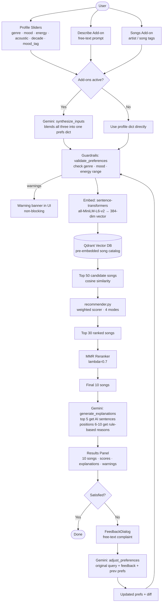

# System Architecture

## Component Overview



## Data Flow

1. User submits profile + optional add-ons
2. Gemini synthesizes all inputs into one preference dict — skipped if no add-ons
3. Guardrails validate the dict and collect non-blocking warnings
4. sentence-transformers embeds the dict into a 384-dim vector
5. Qdrant returns top 50 semantically similar songs
6. recommender.py scores all 50, returns top 30
7. MMR reranker picks the final 10 balancing relevance and diversity
8. Gemini writes explanations for the top 5
9. Results returned to frontend with warnings and resolved prefs
10. If user rejects, Gemini adjusts the profile and pipeline reruns from step 3

## Components

| Component | File | Role |
|---|---|---|
| Input synthesis | `ai/gemini.py` | Blends profile + text + songs into prefs dict |
| Guardrails | `ai/guardrails.py` | Validates prefs, surfaces warnings |
| Embeddings + MMR | `ai/embeddings.py` | Encodes prefs/songs, MMR reranking |
| Vector search | `ai/qdrant_db.py` | ANN search over pre-embedded catalog |
| Scorer | `src/recommender.py` | Weighted re-rank of top 50 candidates |
| Explanations + Feedback | `ai/gemini.py` | AI explanations, preference adjustment |
| API | `server/app.py` | FastAPI — POST /recommend, /recommend/retry |
| Frontend | `client/src/` | React + Vite UI |
```
